# WGIMS — Complete Process Flow Documentation

**Welfare Goods Inventory Management System (DSWD Region X)**
Based on the actual Laravel codebase (routes, controllers, models, middleware, services, views).

> **Purpose of this document**
> - Understand how the entire system works end-to-end
> - Use as a testing/QA checklist (every decision point = a test case)
> - Locate where bugs occur (each box names the exact file that runs it)
> - Explain the system to users and support the user manual
> - Show exactly how inventory quantities move through the system

---

## How to read these diagrams

- **Diamond shapes** are decision points (questions the system asks).
- **Rectangles** are actions/steps.
- **Text in brackets** like `[AuthController.php:41]` tells you the exact file and line that performs the step — useful for QA and debugging.
- **Bold role names** show who is allowed to do each step.

### The 5 user roles and what they may do

| Role | Create documents (subsidy, delivery, RIS, transfer) | Approve/issue RIS | Edit master data (categories, suppliers, warehouses, users) | Correct / delete documents |
|---|---|---|---|---|
| **Admin** | ✅ | ✅ | ✅ | ✅ |
| **Warehouse Manager** | ✅ | ✅ | ❌ (view only) | ❌ |
| **Supply Custodian** | ❌ | ✅ | ❌ | ❌ |
| **Center Head** | ❌ | ✅ | ❌ | ❌ |
| **Center Staff** | ❌ | ❌ | ❌ | ❌ |

All non-admin/WM roles see **only the warehouses assigned to them** (`app/Http/Controllers/Concerns/ScopesWarehouse.php`).

---

# PART 1 — HIGH-LEVEL OVERALL SYSTEM FLOW

## 1.1 The big picture: how goods flow through WGIMS

```
 SUPPLIER
    │  delivers goods against a subsidy
    ▼
 SUBSIDY  (SUB-000001)          ← the "request/demand" document (what SHOULD arrive)
    │  shipped in one or more batches ("deliveries"/dispatches)
    ▼
 DELIVERY BATCH                 ← assigns warehouse + unit cost + ENGAS cost + expiry + DR#
    │  stock physically enters
    ▼
 STOCK RECORDS  (items table)   ← THE inventory: one record per warehouse per batch
    │                              (identity = subsidy + description + unit cost +
    │                               ENGAS cost + expiry date + warehouse)
    │
    ├──────────────► RIS  (RIS-000001) ── approved & issued ──► quantities LEAVE stock
    │                (requisition from a center/office)
    │
    ├──────────────► STOCK TRANSFER  (TRF-2026-0001) ── quantities MOVE between warehouses
    │                (source warehouse → destination warehouse)
    │
    ▼
 EVERY movement writes a STOCK CARD entry (receipt / issue / transfer in / transfer out)
    │
    ▼
 REPORTS:  RPCI (physical count) · RSMI (issued supplies) · Inventory Balance (live) · Stock Cards
```

## 1.2 Overall system process flow (flowchart)

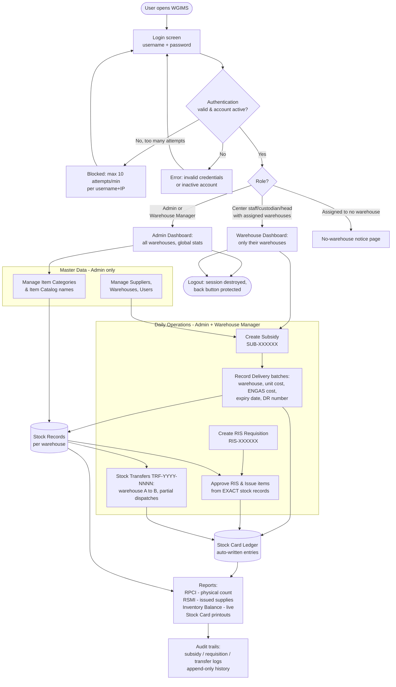

## 1.3 Module relationship map (how documents link together)

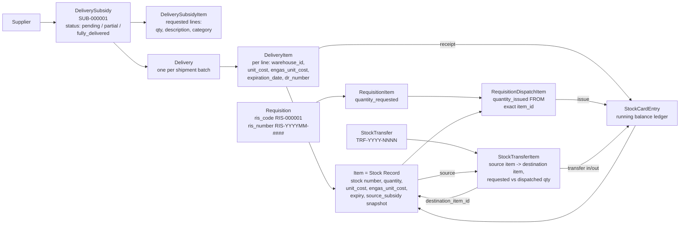

**Key idea for non-programmers:** every quantity in WGIMS lives on an *Item row* (a stock record). Documents never hold stock themselves — they only move quantities onto or off of stock records, and every movement is journalled into a Stock Card entry so the running balance can always be replayed and verified.

---

# PART 2 — USER LOGIN & AUTHENTICATION

## 2.1 Login flowchart

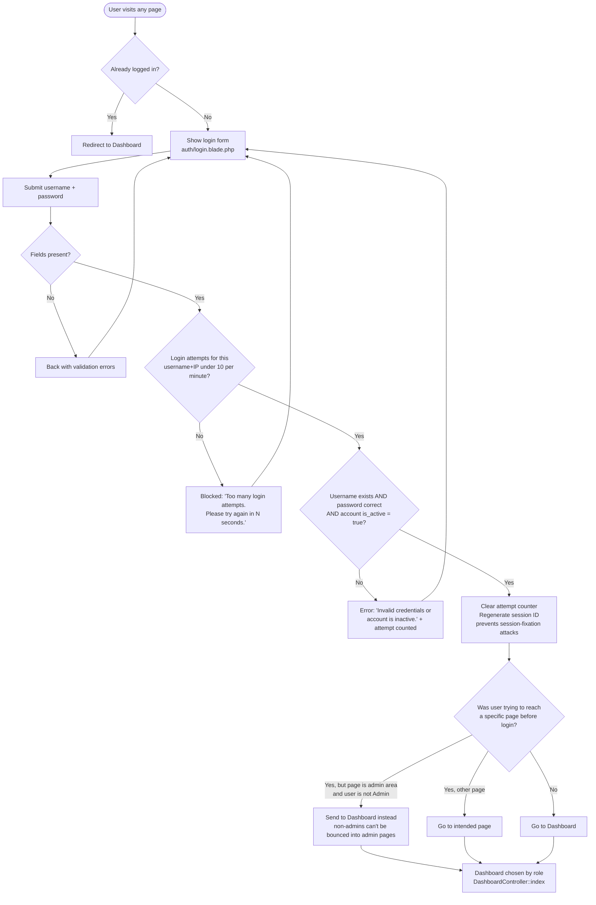

## 2.2 What happens on every request after login

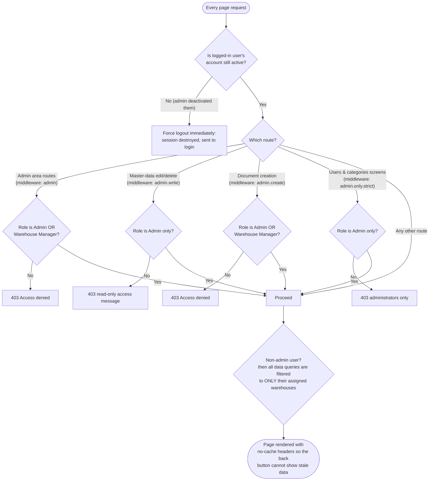

## 2.3 Logout & session protection

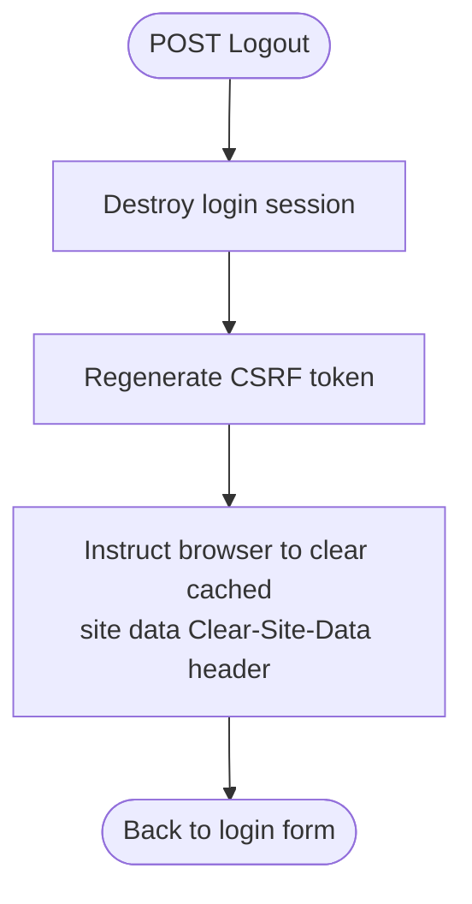

Protection summary:
- Login rate limit: **10 attempts / minute** per username+IP `[AuthController.php:28-33]`
- Inactive accounts fail login exactly like wrong passwords and are also **logged out mid-session** if deactivated later `[EnsureUserIsActive.php:20-31]`
- Session ID regenerated at login; CSRF token regenerated at logout `[AuthController.php:48-50, 82-83]`
- All pages sent with `no-store` cache headers → browser back-button cannot redisplay protected pages `[NoCache.php:29-51]`

## 2.4 Files behind each step

| Flow step | File(s) |
|---|---|
| Routes `/login`, `/logout`, dashboard | `routes/web.php:24-30` |
| Login logic, rate limiting, redirects | `app/Http/Controllers/AuthController.php` (login: lines 18–77, logout: 79–91) |
| Role checks on every request | `app/Http/Middleware/AdminOnly.php` (`admin`), `AdminWriteOnly.php` (`admin.write`), `AdminCreateOnly.php` (`admin.create`), `AdminOnlyStrict.php` (`admin.only.strict`), `EnsureUserIsActive.php`, `NoCache.php` |
| Middleware registration | `bootstrap/app.php:14-28` |
| Role helper methods | `app/Models/User.php` (`isAdmin`, `isWarehouseManager`, `hasAdminAccess`, `canWrite`, `canCreate`, `canApprove`, `isWarehouseUser`) |
| Per-role dashboards | `app/Http/Controllers/DashboardController.php` + views `resources/views/dashboard/admin.blade.php`, `dashboard/warehouse.blade.php`, `dashboard/no_warehouse.blade.php` |
| Warehouse scoping of all queries | `app/Http/Controllers/Concerns/ScopesWarehouse.php` |

---

# PART 3 — ITEM & ITEM CATEGORY MANAGEMENT (Master Data)

## 3.1 Flowchart

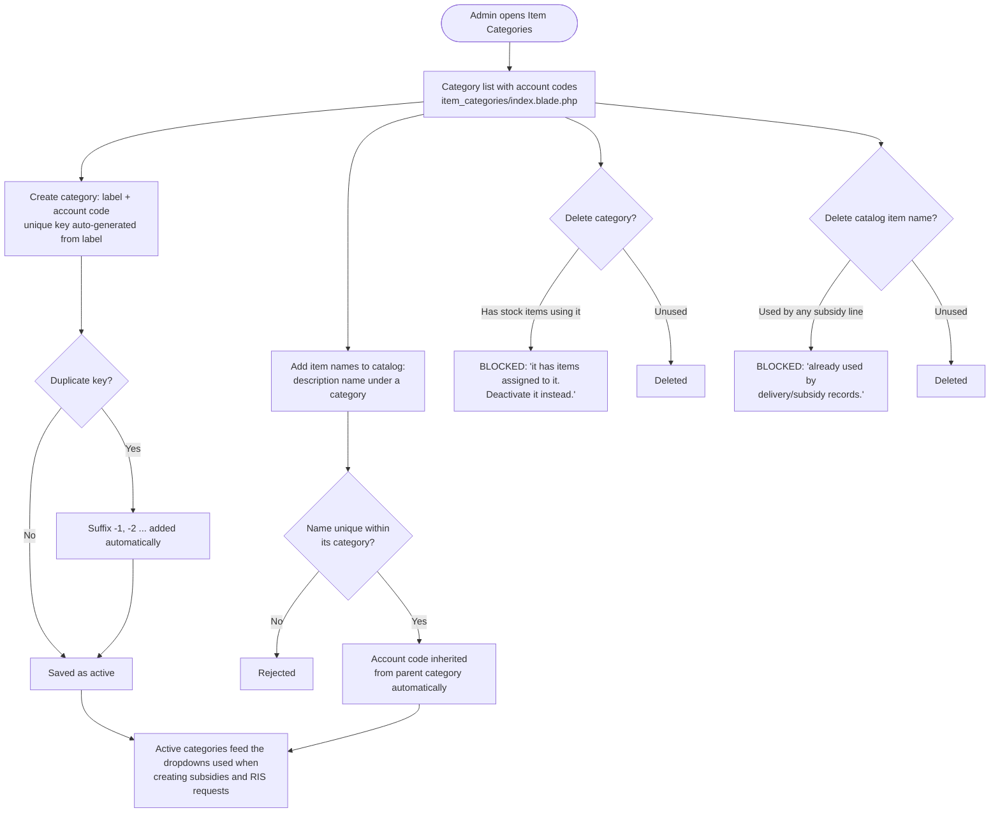

## 3.2 How stock records (Items) relate to the catalog

The catalog (category + item name + account code) is only the *vocabulary*. Actual inventory rows are created automatically when a delivery is recorded (see Part 4). One catalog item can therefore have **many** stock records — one per warehouse, per unit cost, per expiry date, per originating subsidy.

Display rule: identical-looking records (same description + unit cost + ENGAS cost + expiry + warehouse) are grouped in the Items list with a **“Merged (N)”** badge showing summed quantity `[ItemController.php:92-114]`.

## 3.3 Files behind each step

| Flow step | File(s) |
|---|---|
| Category CRUD (admin only) | `app/Http/Controllers/ItemCategoryController.php` (store: 23–61, destroy guard: 83–96) |
| Catalog item CRUD (admin only) | `app/Http/Controllers/ItemCatalogItemController.php` (delete guard: 61–72) |
| Stock record list / merged badge / create / delete guards | `app/Http/Controllers/ItemController.php` (index grouping: 92–114, manual create: 135–199, delete guards: 260–294) |
| Models | `app/Models/ItemCategory.php` (60s-cached active list), `app/Models/ItemCatalogItem.php`, `app/Models/Item.php` |
| Views | `resources/views/item_categories/index.blade.php`, `resources/views/items/*.blade.php` |

---

# PART 4 — SUPPLIER / SUBSIDY / DELIVERY FLOW (detailed)

This is the **inbound** pipeline: goods arriving from a supplier into warehouses.

## 4.1 Stage 1 — Create the Subsidy *(Admin or Warehouse Manager)*

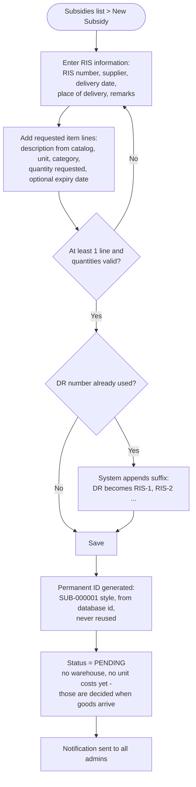

**Important:** `quantity_requested` is the original demand and is **never recalculated** later by delivered amounts. Delivered quantities are tracked separately beside it. `[routes note: DeliverySubsidyController::store lines 143–236]`

## 4.2 Stage 2 — Record a Delivery / Dispatch batch *(Admin or Warehouse Manager)*

One subsidy can be fulfilled by **multiple partial deliveries**.

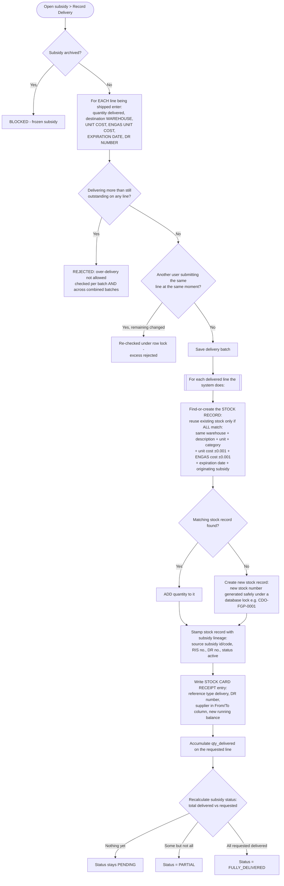

## 4.3 Stage 3 — Corrections and reversals *(Admin only)*

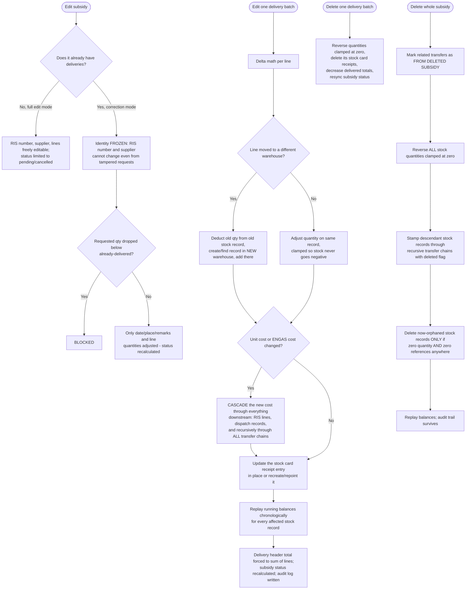

Archive/Restore: archiving freezes a subsidy (**blocks new deliveries**) and flags its transfers/items “FROM ARCHIVED SUBSIDY”; restore clears the flags. Nothing is ever silently lost — lineage snapshots keep traceability even after deletion or archiving.

## 4.4 Files behind each step

| Flow step | File(s) |
|---|---|
| Routes | `routes/web.php:62-87` |
| Create subsidy | `DeliverySubsidyController::store` (lines 143–236); `SUB-` code in `app/Models/DeliverySubsidy.php:23-29`; DR duplicate check API `routes/web.php:216-218` |
| Status recalculation pending/partial/fully_delivered | `app/Models/DeliverySubsidy.php:updateDeliveryStatus` (lines 100–117) |
| Record delivery batch | `DeliverySubsidyController::storeDelivery` (lines 1113–1418) |
| Find-or-create stock record (identity rules) | `app/Models/Item.php:findOrCreateByUnitCost` (lines 265–365) |
| Safe stock-number generation | `app/Models/Item.php:generateStockNumber` (lines 367–417, MySQL GET_LOCK) |
| Auto-deactivate empty stock | `app/Models/Item.php` saving hook (lines 41–54) |
| Subsidy lineage snapshots | `app/Models/Item.php:applySubsidySnapshot` (lines 197–214) |
| Edit subsidy (correction vs full edit) | `DeliverySubsidyController::update` (lines 329–628) |
| Edit delivery batch + cascade | `DeliverySubsidyController::updateDelivery` (lines 1457–1832); cascade engine `app/Services/DeliverySubsidyCascadeService.php` |
| Delete delivery / subsidy reversal | `destroyDelivery` (1842–1900), `destroy` (630–768) |
| Archive / restore | `archive` (836–873), `restore` (880–935) |
| Audit trail view | `auditLog` action + `resources/views/delivery_subsidies/audit_log.blade.php` |
| Views | `resources/views/delivery_subsidies/*.blade.php` (create, delivery, show, edit, edit_delivery, audit_log) |

---

# PART 5 — REQUISITIONS / RIS FLOW (detailed)

RIS = *Requisition and Issue Slip* (official DSWD form). This is the **outbound** pipeline: centers/offices requesting goods. (The menu label “Augmentations” refers to this same module — there is no separate augmentation entity.)

## 5.1 Stage 1 — Create the RIS *(Admin or Warehouse Manager)*

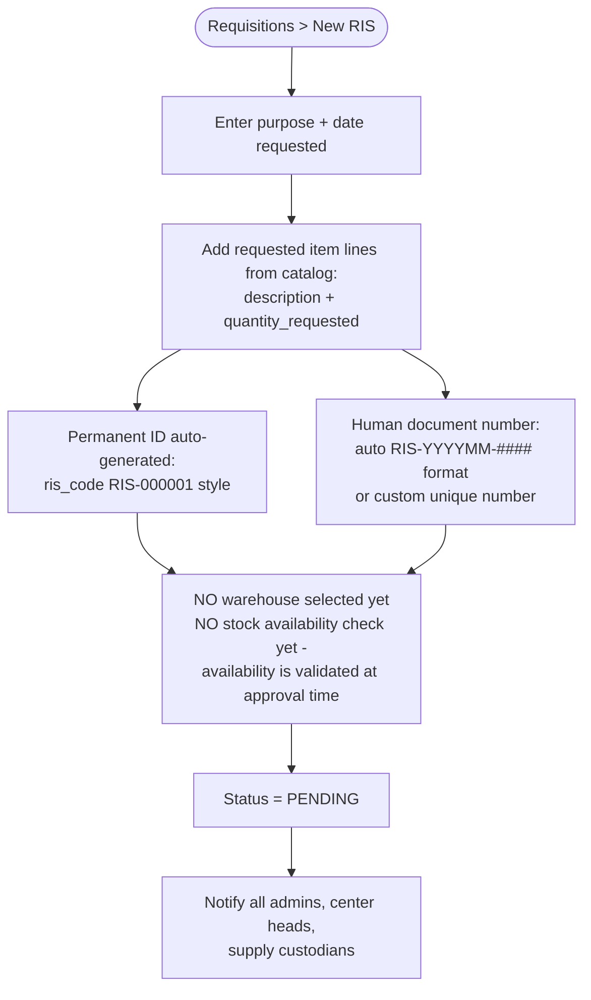

## 5.2 Stage 2 — Approve & Issue *(Admin, Warehouse Manager, Supply Custodian, Center Head — NOT Center Staff)*

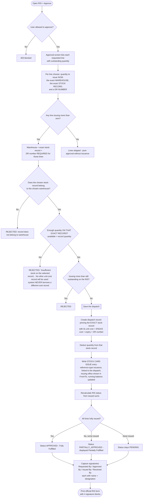

Partial fulfillment: repeat Stage 2 anytime — each run issues additional quantities from whatever exact records are chosen.

## 5.3 Stage 3 — Corrections and reversals *(Admin only)*

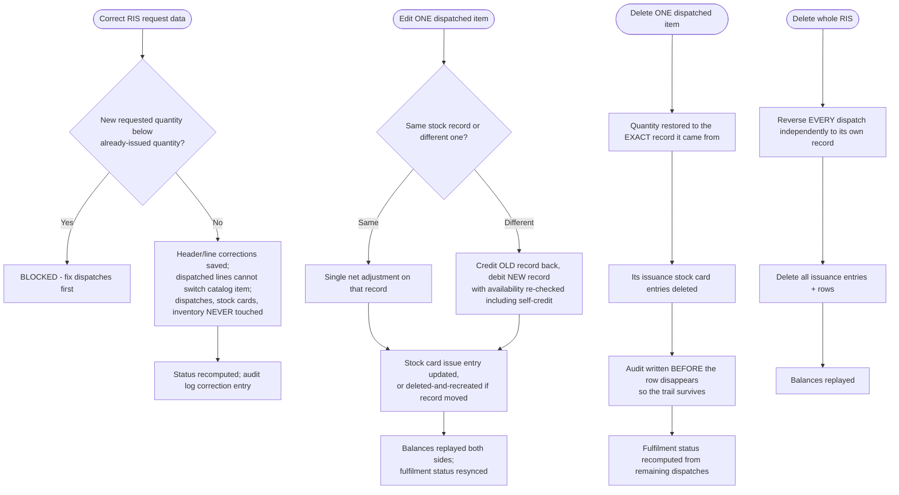

## 5.4 Files behind each step

| Flow step | File(s) |
|---|---|
| Routes | `routes/web.php:89-127` |
| Number generation | `ris_code` in `app/Models/Requisition.php:27-33`; `ris_number` RIS-YYYYMM-#### in `generateRisNumber` (245–262) |
| Create RIS | `RequisitionController::store` (204–329) |
| Approval gate (who may approve) | `User::canApprove` + controller lines 856–889 |
| Issue/approve processing | `processApproval` (880–1073): exact-record lock 944–956, availability check 962–970, dispatch creation 985–994, stock card 998–1013, status 1027, signatories 1030–1039 |
| Status recalculation | `app/Models/Requisition.php:updateFulfilmentStatus` (212–243) |
| Request-only correction | `correct()` (636–811) |
| Dispatch edit/delete | `updateDispatch` (1154–1341), `destroyDispatch` (1351–1437), whole-RIS `destroy` (511–567) |
| Print RIS | `printRis` (1461–1468) + `resources/views/requisitions/print.blade.php` |
| Helper APIs | `/api/requisition-items` (items in a warehouse), `/api/requisition-description-items` — `routes/web.php:125-127` |
| Audit | `app/Models/RequisitionAuditLog.php`; view `requisitions/audit_log.blade.php` |
| Views | `resources/views/requisitions/*.blade.php` |

---

# PART 6 — STOCK TRANSFER FLOW (detailed)

Moving stock between warehouses. Two steps by design: **Request** then **Dispatch** (partial dispatches allowed).

## 6.1 Stage 1 — Create transfer request *(Admin or Warehouse Manager)*

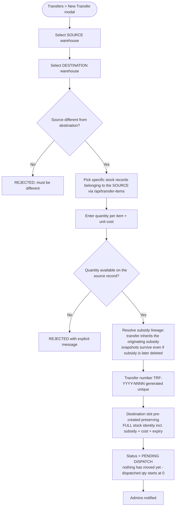

## 6.2 Stage 2 — Dispatch *(Admin or Warehouse Manager)*

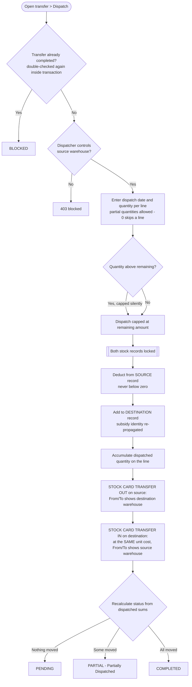

Multiple partial dispatches are supported — each creates another pair of transfer-out/transfer-in entries.

## 6.3 Stage 3 — Correction / Deletion *(Admin only)*

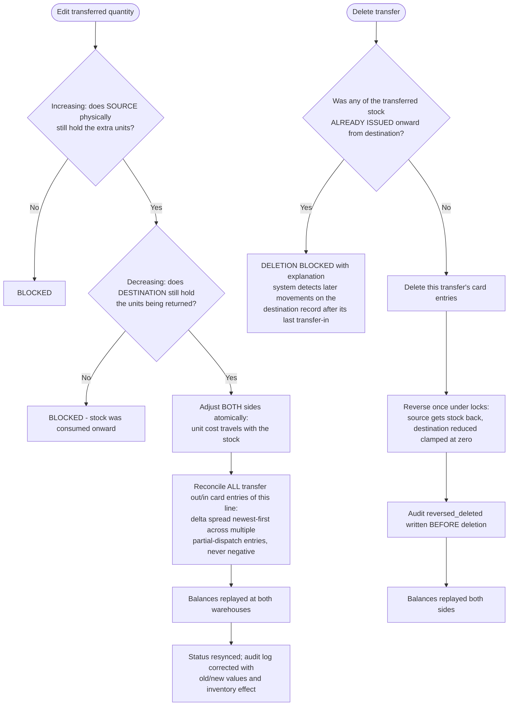

## 6.4 Files behind each step

| Flow step | File(s) |
|---|---|
| Routes | `routes/web.php:138-154`; item picker API `/api/transfer-items` line 142 |
| Number generation TRF-YYYY-NNNN | `app/Models/StockTransfer.php:187-202` |
| Create request + lineage resolution + pre-created destination slot | `StockTransferController::store` (111–272) |
| Dispatch (both-side moves + dual card entries) | `dispatch`/`processDispatch` (277–440) |
| Status pending/partial/completed | `app/Models/StockTransfer.php:updateTransferStatus` (84–104) |
| Two-sided correction with newest-first card reconciliation | `update` (582–816; delta spread helper 828–853) |
| Deletion blocker + reversal | `destroy` (874–977), blocker check `destroyBlockers` (985–1022) |
| Audit | `app/Models/StockTransferAuditLog.php` |
| Views | `resources/views/transfers/*.blade.php` (index + create modal, dispatch, show, edit, print) |

---

# PART 7 — INVENTORY / STOCK MANAGEMENT & STOCK CARDS (detailed)

## 7.1 What a “stock record” is (the heart of the system)

Each row in the `items` table = one physical batch in one warehouse:

| Field | Meaning |
|---|---|
| `stock_number` | Official card number, e.g. `CDO-FGP-0001` ({WAREHOUSE}-{CATEGORY}-####) |
| `quantity` | Current on-hand quantity |
| `unit_cost` / `engas_unit_cost` | Both travel together everywhere (reports show Engas Total Value = qty × ENGAS cost) |
| `expiration_date` | Optional; part of identity |
| `source_subsidy_*` columns | Lineage: which subsidy/RIS/DR this stock came from — survives transfers and subsidy deletion |
| `is_active` | Auto-deactivates when quantity reaches 0, reactivates when stock returns |

**Identity rule:** two records are “the same stock” only if warehouse + description + unit + category + unit cost + ENGAS cost + expiry + originating subsidy ALL match. Otherwise they stay separate batches. `[Item::findOrCreateByUnitCost, Item.php:265-365]`

## 7.2 Quantity movement map — every way stock changes

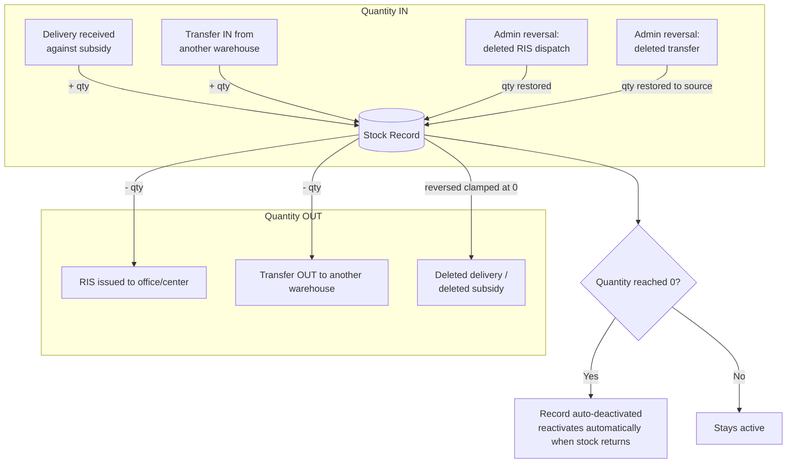

**There are NO manual stock adjustments.** Only real movements write to inventory.

## 7.3 Stock Card engine (automatic ledger)

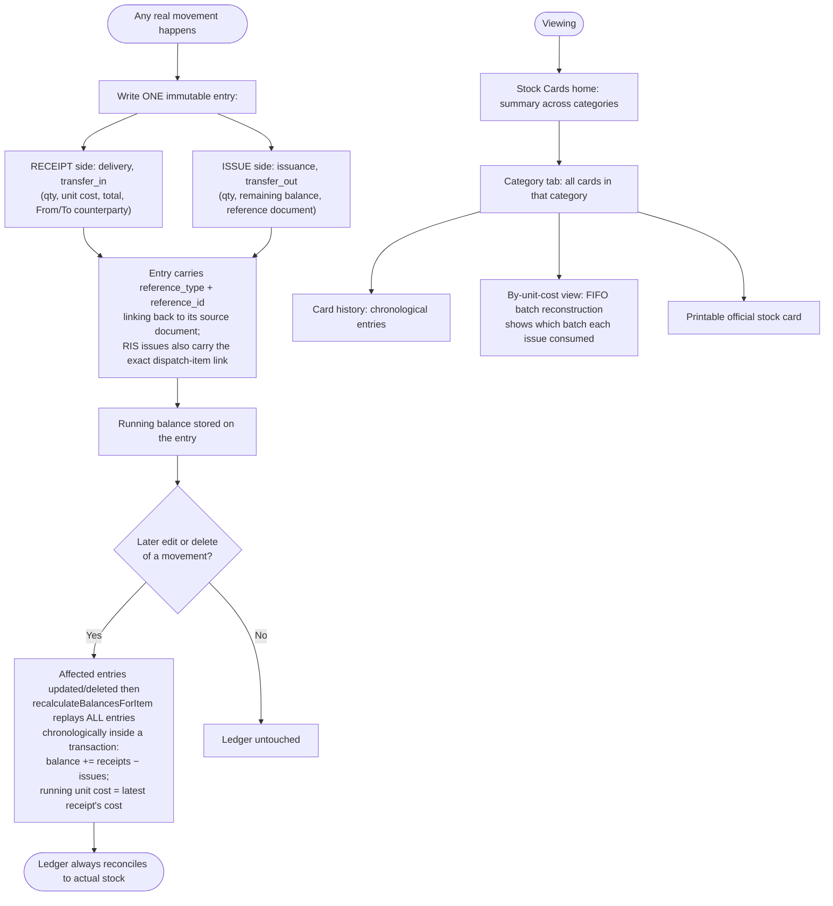

Warehouse protection: viewing a card requires access to that card’s warehouse (403 otherwise) `[StockCardController.php:43-45, 61, 118]`.

## 7.4 Inventory Balance report (live) *(Admin + Warehouse Manager only)*

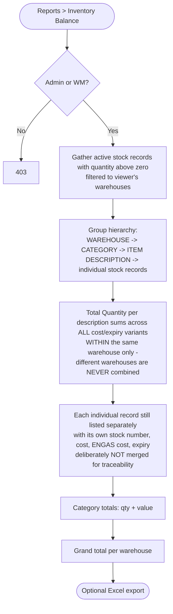

## 7.5 Files behind each step

| Flow step | File(s) |
|---|---|
| Stock record identity/creation/deactivation | `app/Models/Item.php` |
| Stock card ledger model + balance replay | `app/Models/StockCardEntry.php:recalculateBalancesForItem` (38–65) |
| Who writes entries | `DeliverySubsidyController::storeDelivery` (delivery receipts), `RequisitionController::processApproval` (issuance), `StockTransferController::processDispatch` (transfer_in/out) |
| Stock card screens | `app/Http/Controllers/StockCardController.php` (summary 131–158, index 17–38, itemHistory 40–55, FIFO by-unit-cost 57–112, print 114–129) + `resources/views/stock_cards/*.blade.php` |
| Inventory Balance | `ReportController::inventoryBalance` (282–363) + export (580–688) + `resources/views/reports/inventory_balance.blade.php` |

---

# PART 8 — REPORTS

## 8.1 Report flows

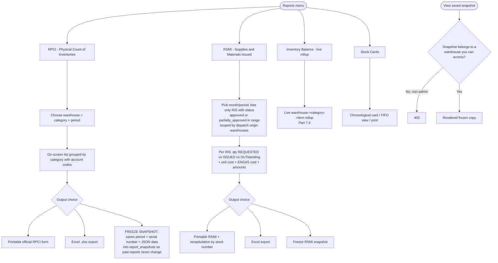

## 8.2 Files behind each step

| Report | Controller methods | Views |
|---|---|---|
| RPCI (list/print/export/snapshot) | `ReportController::rpci` (19–43), `printRpci` (45–64), `saveRpciSnapshot` (66–100), `exportRpci` (367–465) | `reports/rpci.blade.php`, `reports/rpci_print.blade.php`, `reports/snapshot.blade.php` |
| RSMI (list/print/export/snapshot) | `rsmi` (102–164), `printRsmi` (166–230), `saveRsmiSnapshot` (232–280), `exportRsmi` (467–578) | `reports/rsmi.blade.php`, `reports/rsmi_print.blade.php` |
| Inventory Balance (+export) | `inventoryBalance` (282–363), `exportInventoryBalance` (580–688) | `reports/inventory_balance.blade.php` |
| Snapshot viewing | `viewSnapshot` (690–705) | `reports/snapshot.blade.php` |
| Model | `app/Models/ReportSnapshot.php` (`report_type` rpci/rsmi, `period_month`, JSON payload) | |

---

# PART 9 — AUDIT & DATA INTEGRITY

## 9.1 Three append-only audit trails

| Log table | Recorded actions | Written when |
|---|---|---|
| `delivery_subsidy_audit_logs` | `update`, `correction`, `archive`, `restore` (+cascade summaries) | Subsidy edited/corrected/archived/restored, delivery edited |
| `requisition_audit_logs` | `correction`, `dispatch_deleted` | RIS corrected; dispatched item deleted |
| `stock_transfer_audit_logs` | `corrected`, `reversed_deleted`, `subsidy_archived`, `subsidy_restored`, `subsidy_deleted` | Transfer corrections/deletions and subsidy state propagation |

Design guarantee: audit rows about deletions are written **BEFORE** the parent row disappears, so the trail survives the deletion. Each row stores changed fields as JSON (transfers/subsidies also store the inventory effect).

## 9.2 Data-integrity rules the system enforces (QA checklist)

| # | Rule | Where enforced |
|---|---|---|
| 1 | Requested quantities are NEVER overwritten by delivered/issued/transferred amounts | Separation throughout controllers; statuses derived from sums |
| 2 | Over-delivery of a subsidy line impossible (single batch and combined batches, tolerance ε=0.0001) | `storeDelivery` 1201–1221; re-checked under row lock 1256–1262 |
| 3 | RIS issuance only from the EXACT stock record; insufficient → reject, never borrow another cost record | `processApproval` 944–970 |
| 4 | RIS availability validated at approval time, not at request time | Same block |
| 5 | Stock can never go negative — every deduction/reversal clamped ≥ 0 | All reversal paths |
| 6 | Transfer source ≠ destination | Validation + DB-level check `store` L123–134 |
| 7 | Transfer edits adjust BOTH warehouses atomically; increases require physical stock at source; decreases require units still held at destination | `StockTransferController::update` 615–671 |
| 8 | Deleting a transfer blocked if its stock was already issued onward | `destroyBlockers` 985–1022 |
| 9 | Every movement writes an immutable stock card entry; NO manual adjustments exist | Parts 4–7 pipelines |
| 10 | After any edit/delete, running balances are replayed chronologically inside a transaction | `StockCardEntry::recalculateBalancesForItem` |
| 11 | Stock keeps lineage (originating subsidy + snapshots) through transfers, subsidy deletion, and archiving (“FROM DELETED/ARCHIVED SUBSIDY” review badges) | `applySubsidySnapshot` + cascade service BFS walk |
| 12 | Deleting a subsidy hard-deletes orphan stock records only if zero quantity AND zero references | `destroy` 719–736 |
| 13 | Categories/catalog items/suppliers can’t be deleted while referenced — deactivate instead | ItemCategoryController 83–96; ItemCatalogItemController 61–72; Supplier toggle only |
| 14 | Non-admin users see/mutate ONLY their assigned warehouses — server-side on every query incl. AJAX | `ScopesWarehouse` trait used by all controllers |
| 15 | Unauthorized direct URL access returns 403 (middleware + controller gates), never silent failure | Middleware chain (Part 2.2) |
| 16 | Cost changes cascade downstream through RIS lines, dispatches, and recursive transfer chains | `DeliverySubsidyCascadeService::cascadeItemCost` |
| 17 | Unit cost and ENGAS unit cost stay separate values everywhere (never collapsed) | Identity keys, dispatch lines, cards, reports |
| 18 | Concurrent submissions serialized with row locks (`lockForUpdate`) and advisory lock for stock numbers | storeDelivery, processApproval, processDispatch, generateStockNumber |

---

# APPENDIX — Quick file index by module

| Module | Route definitions | Controller | Key models/services | Main views |
|---|---|---|---|---|
| Auth | `routes/web.php:24-26` | `AuthController` | `User`, middleware `EnsureUserIsActive`, `NoCache` | `auth/login.blade.php` |
| Dashboard | `routes/web.php:30` | `DashboardController` | — | `dashboard/{admin,warehouse,no_warehouse}.blade.php` |
| Item categories & catalog | `web.php:33-44` | `ItemCategoryController`, `ItemCatalogItemController` | `ItemCategory`, `ItemCatalogItem` | `item_categories/index.blade.php` |
| Items (stock records) | `web.php:47-59` | `ItemController` | `Item` | `items/*.blade.php` |
| Suppliers | `web.php:156-168` | `SupplierController` | `Supplier` | `suppliers/*.blade.php` |
| Warehouses | `web.php:183-196` | `WarehouseController` | `Warehouse` | `warehouses/*.blade.php` |
| Users | `web.php:198-211` | `UserController` | `User` | `users/*.blade.php` |
| Subsidies/Deliveries | `web.php:62-87` | `DeliverySubsidyController` | `DeliverySubsidy(+Item)`, `Delivery(+Item)`, `DeliverySubsidyAuditLog`, `DeliverySubsidyCascadeService` | `delivery_subsidies/*.blade.php` |
| Requisitions/RIS | `web.php:89-127` | `RequisitionController` | `Requisition(+Item,+DispatchItem)`, `RequisitionAuditLog` | `requisitions/*.blade.php` |
| Stock transfers | `web.php:138-154` | `StockTransferController` | `StockTransfer(+Item)`, `StockTransferAuditLog` | `transfers/*.blade.php` |
| Stock cards | `web.php:129-136` | `StockCardController` | `StockCardEntry` | `stock_cards/*.blade.php` |
| Reports | `web.php:170-181` | `ReportController` | `ReportSnapshot` | `reports/*.blade.php` |
| Notifications | `web.php:267-273` | `NotificationController` | `SystemNotification` | `notifications/index.blade.php` |
| AJAX helpers (throttled 120/min) | `web.php:213-265` | closures + `RequisitionController`, `StockTransferController` | — | — |

---

*Generated from the codebase: routes/web.php, bootstrap/app.php, all controllers under app/Http/Controllers, models under app/Models, services under app/Services, middleware under app/Http/Middleware, and resources/views.*
